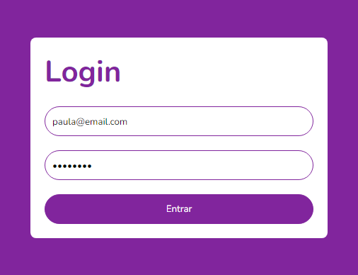

<h1 align="center"> Implementando Uma Tela de Login com Validação Usando TypeScript </h1>

Projeto desenvolvido como desafio do bootcamp Orange Tech da DIO.

  <a href="#-tecnologias">Tecnologias</a>&nbsp;&nbsp;&nbsp;|&nbsp;&nbsp;&nbsp;
  <a href="#-projeto">Projeto</a>&nbsp;&nbsp;&nbsp;

 

  

## 🚀 Tecnologias

Esse projeto foi desenvolvido com as seguintes tecnologias:

- HTML e CSS
- JavaScript
- TypeScript
- [React](https://pt-br.reactjs.org/)
- [Styled Componentes](https://styled-components.com/)
- [React Hook Form](https://react-hook-form.com/)

## 💻 Projeto

Esse projeto tem como objetivo criar uma tela de login com validação utilizando o TypeScript.

 

---

This project was bootstrapped with [Create React App](https://github.com/facebook/create-react-app).
